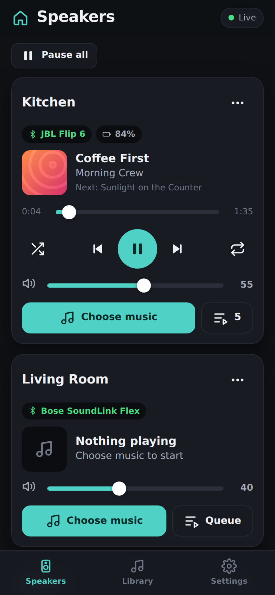
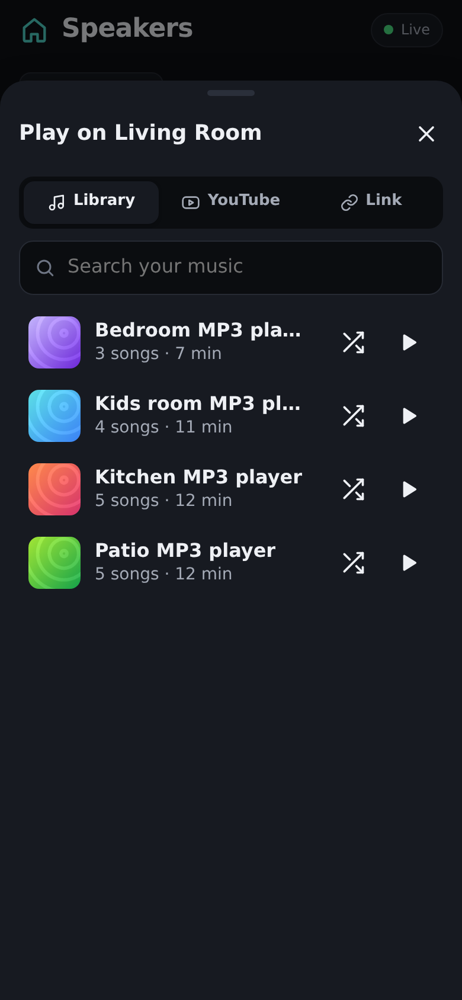
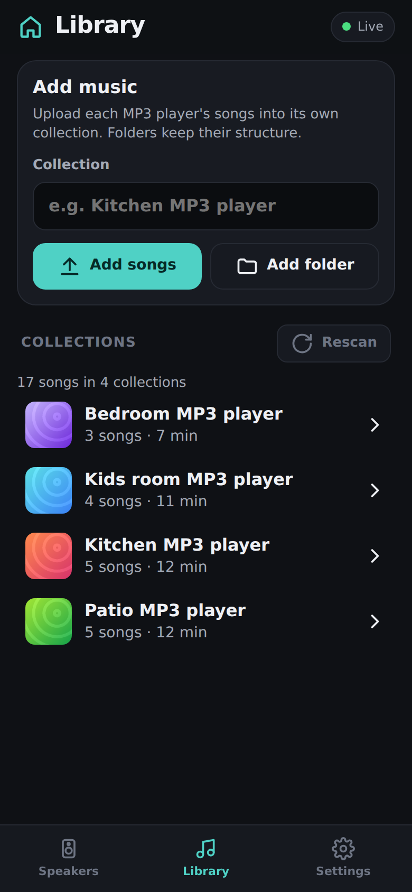
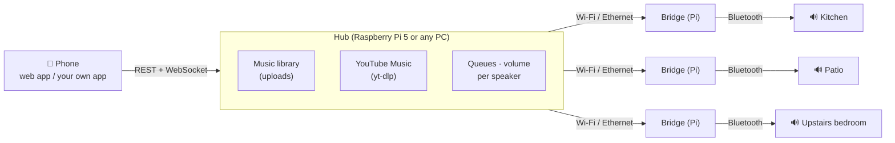

# Home Audio: phone-controlled multi-room Bluetooth audio

> Experimental branch (`claude/upbeat-edison-2k76xq`). **Not meant to be merged into `main`.**

A web app on your phone decides **what plays on which Bluetooth speaker**. Up to 6 or more speakers can each play different music at the same time, from one system:

- **Your own music:** upload everything from your old MP3 players, one collection per player.
- **YouTube Music:** search, or paste any song, album or playlist link.
- **Any stream URL:** internet radio, or media from your own custom app.
- **Status per speaker:** see which bridges and speakers are online, with speaker battery level where the speaker reports it.
- **Mixed playlists:** build playlists that combine library songs, YouTube Music songs and links. A YouTube Music playlist link plays right away, or joins any queue.
- **Preview on your phone:** 🎧 plays a song on the phone only, before you send it to a speaker. On a speaker card, 🎧 listens along to that speaker.
- **Live demo:** https://home-audio-kx2w.onrender.com/demo/
- **Stream-only volume per speaker.** The speaker's own volume is **never** changed by the system.

<p align="center">
  
  
  
</p>

## How it works



- **Hub** (`hub/`): Node.js server. It holds the music library, resolves YouTube Music, keeps each speaker's queue, shuffle, repeat and volume, and serves the phone app plus a REST/WebSocket API.
- **Bridge** (`agent/`): one small process per speaker, normally on a Raspberry Pi within a few metres of the speaker. It plays the hub's stream with `mpv`, keeps the speaker connected through BlueZ with auto-reconnect, and reports status.
- **Volume guarantee:** bridges turn off Bluetooth absolute volume (AVRCP) in WirePlumber and apply volume in software inside `mpv`. Set a speaker's own volume once; the system never moves it. See [docs/HARDWARE.md](docs/HARDWARE.md#keeping-the-speakers-volume-untouched).
- **Resilience:** the hub owns every queue, and bridges are thin players.
  - A bridge or the hub can restart mid-song and the music continues.
  - A speaker that switches off pauses its room; when the speaker comes back, the room resumes.
  - State survives power cuts.

## Try it now (any computer, no hardware)

```bash
cd multiroom
npm install
npm run demo        # six simulated speakers + a generated sample library
```

Open the printed address on your phone (same Wi-Fi) or at `http://localhost:8080`.

## Documentation

| | |
|---|---|
| [docs/HARDWARE.md](docs/HARDWARE.md) | What to buy (off-the-shelf), costs, and why one small bridge per speaker |
| [docs/SETUP.md](docs/SETUP.md) | Step-by-step install: hub, music import, pairing, bridges, phone, remote access, YouTube Music |
| [docs/VERIFY_EXISTING_SYSTEM.md](docs/VERIFY_EXISTING_SYSTEM.md) | Check whether your current whole-home system can really play a different song per room, and why upstairs might differ |
| [docs/API.md](docs/API.md) | REST + WebSocket reference for building your own mobile or web app |
| [docs/SHOPPING_LIST.md](docs/SHOPPING_LIST.md) | **What to order** (Amazon), for the pilot and the full 10 speakers |
| [docs/SPEAKERS.md](docs/SPEAKERS.md) | Notes for your speakers (Sony receiver, BolaButty X-GO) |
| [docs/SETUP_CLOUD.md](docs/SETUP_CLOUD.md) | **The chosen setup:** cloud app on Render plus one home Pi (music on its SSD, all speakers) |
| [docs/PLAN_DISCUSSION.md](docs/PLAN_DISCUSSION.md) | **Hardware/setup options under discussion** (central box vs bridges, 6 vs 10 speakers, demo/production hosting) |
| [docs/OPEN_ITEMS.md](docs/OPEN_ITEMS.md) | Open questions, pending hardware tests, and the feature backlog |

## Project layout

```
multiroom/
  hub/            server (src/), phone web app (public/), demo + test helpers (scripts/), tests
  agent/          speaker bridge: mpv player, BlueZ link, hub connection, tests
  tools/          discover-audio-systems.js — scans your network's existing audio systems
  deploy/         install-hub.sh, install-agent.sh, pair-speaker.sh, WirePlumber + systemd files
  docs/           guides
```

## Tests

`npm test` runs 63 tests across the three packages.

- **Hub**
  - queue logic, library indexing and uploads (including path-traversal attempts), HTTP Range streaming and auth
  - speakers with simulated bridges: play, advance, volume, pause/seek, "play now", speaker loss, and bridge reconnect without interrupting the song
  - a hub restart mid-song
  - YouTube search and playlist resolving, plus the chunked, Range-aware proxy and expired-URL handling, against a fake yt-dlp
  - an end-to-end run with a **real mpv** bridge
- **Bridge:** real `mpv` IPC (paused load, seek-on-load, software volume, end-of-file and error events), and the BlueZ/PipeWire logic against fake `busctl`/`pactl`. That includes reconnect with backoff and the rule that the sink volume is only pinned when hardware volume is disabled.
- **Scanner:** DNS/mDNS encoding, and parsers and probes for Sonos, Yamaha, HEOS and Russound, checked against mock devices.

**Not verified in the development sandbox:**

- real Bluetooth speakers and the WirePlumber configuration on an actual Raspberry Pi
- the install scripts on Raspberry Pi OS (syntax- and shellcheck-clean only)
- yt-dlp against live YouTube, because the sandbox has no YouTube access

These need a first run on real hardware; [docs/SETUP.md](docs/SETUP.md) has a troubleshooting table.
